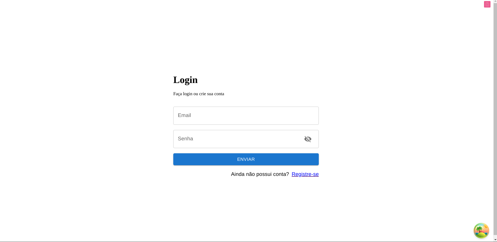

<p align="center">
  
</p>

<p>Link para visitar o site : 
<a href="https://portifolio-git-main-dany679.vercel.app/" />Demo</a>
</p>
<p align='center'> Basic web-site <p/>

## 🚀 Tecnologias

- How to reuse layouts
- Folder structure in Next 13 App Router
- Dynamic titles
- Tailwind design
- Tailwind animations and effects
- Form-hooks
- Zod
- Mui
- TanStack (react-query)
- Cypress (test)
- Next auth
- Search url
- Deploy on vercel

### BackEnd

TO GET THE NEXT_PUBLIC_HTTP

https://github.com/dany679/Nest-company-D-BE

case you run in localhost change in the .env file the place of the url to your localhost or get the url deployed.

NEXT_PUBLIC_HTTP=

### Prerequisites

**Node version 18.x.x**

## 💻 Projeto

O projeto sera um site de cadastro de maquinas e pontos de acesso <a href="https://vercel.com/" /> vercel</a> para rodar no seu próprio computador lembre de acessar de adicionar .env abaixo

## Licença

MIT

## How To Run

### create .env file

```shell

  NEXT_PUBLIC_HTTP=https://fly-teste.fly.dev
  NEXTAUTH_SECRET=
  NEXTAUTH_URL=http://localhost:3000
  email=
  password=
  projectId=
  #project id from cypress

```

after run and sign-up add you email and password in the file.env to use cypress test

### Install packages

```shell
yarn
```

### Start the app

```shell
$ yarn start
```

### test using cypress

```shell
$ yarn test
```
